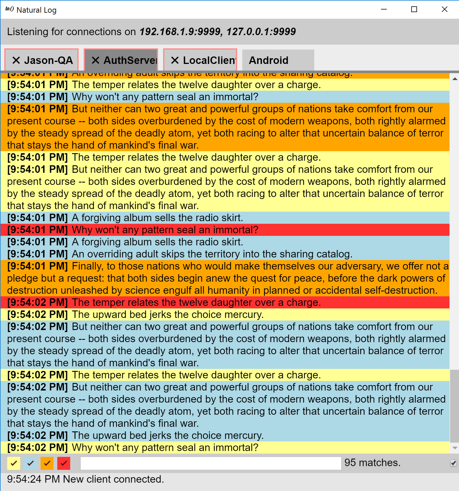

##### Natural-Log

A ~~clumsy, heavyweight~~ nimble, lightweight log server and web client, bundled in a handy cross-platform binary.

##### Tech

We use `electron` to bundle a node.js server and a web client running in Chromium.

The server listens for logs on incoming `websocket` connections. It outputs these logs to the web client using `socket.io`.

The web client takes these `socket.io` events and manipulates DOM elements to present logs. Each connected client gets its own tab in the web-client.

##### Protocol

After establishing a websocket connection, a client can send events to natural-log. All events are text-based and are in the form:

>{Event}:Payload

_Identify_ - This event gives a readable name to a client and is reflected in that client's tab. Eg - `{Identify}:Joe's Laptop`

_Info_ - Sends an info level message. Eg - `{Info}:This is an info log!`

_Debug_ - Sends an info level message. Eg - `{Debug}:This is a debug log!`

_Warn_ - Sends an info level message. Eg - `{Warn}:This is a warning log!`

_Error_ - Sends an info level message. Eg - `{Error}:This is an error log!`

##### Usage

Checkout the **[naturallog-examples](https://github.com/thegoldenmule/naturallog)** project for client libraries.

##### Build and Run

For development:

`npm install && electron .`

For releases:

`npm run package-win package-mac package-linux`

##### Roadmap

Find that **[here](roadmap.md)**.

##### Q&A

**Why doesn't it do this one thing?** Probably because I didn't think about it. Make a feature request!

**Why web tech?** Because the venn-diagram of (Cross Platform Tech) + (Decent UI) is horrifying. _Looking at you Java._

**Can I run the natural-log server somewhere and a natural-log client in a browser?** Yes! Details to come. Electron really has just bundled Node.js and Chromium. Look at the source if you're impatient!